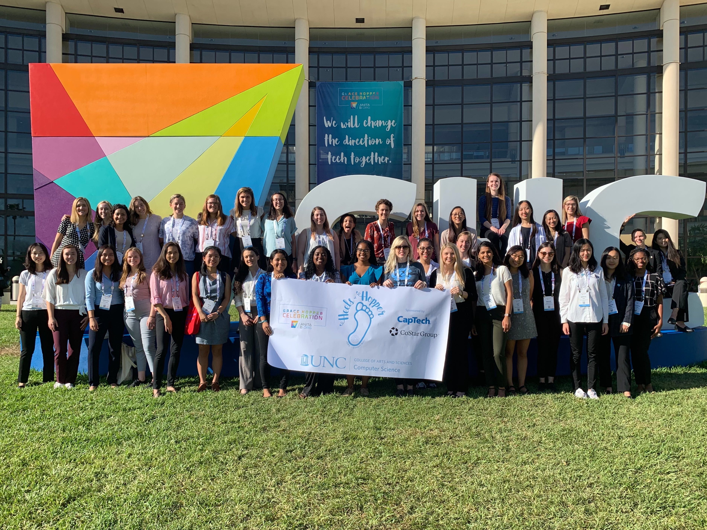

I have never been more overwhelmed than I was during the first week of October while attending Grace Hopper in Orlando, Florida.  It was a long, hard week, but it was also one of the most rewarding experiences of my time in college.

Grace Hopper is a celebration for female-identifying people in technology and computing.  The main features of the conference are sessions held by women who are experts in their field and passionate about promoting diversity in the technology industry.  Another main feature is the Career Fair, which is what inspired my comment about being overwhelmed.  There are hundreds of booths hosted by enormous tech companies, and thousands of young women are swarming around you, throwing elbows, trying to make eye contact with the three recruiters behind the table.  My main goal at the career fair was to collect as much free stuff as possible (and believe me, there’s a lot), but I ended up spending the majority of my time networking with recruiters and setting up interviews.  

As someone who hates to network, Grace Hopper was immersion therapy.  I went to the conference without anything lined up after graduation, so I was in networking mode from 9am to 4pm every day.  It was exhausting, but I learned a lot about approaching a recruiter and presenting myself well.  After three grueling days of standing behind a booth waiting for recruiters all day, I scored two interviews for the last day of the conference.   I had also set up an interview for that Friday before I came to the conference, so I had a full last day at Grace Hopper.

After my interviews, I got to relax at the closing Keynote, where I heard from the most inspirational women who were doing the most incredible things.  Listening to their stories, I knew that all my hard work was going to be worth it if I ended up being half as influential as these women.  With this perspective, I felt so grateful for all the long hours in the Career Fair and all the blisters from my professional shoes, and I can say without a doubt that given the chance, I would definitely attend Grace Hopper again.