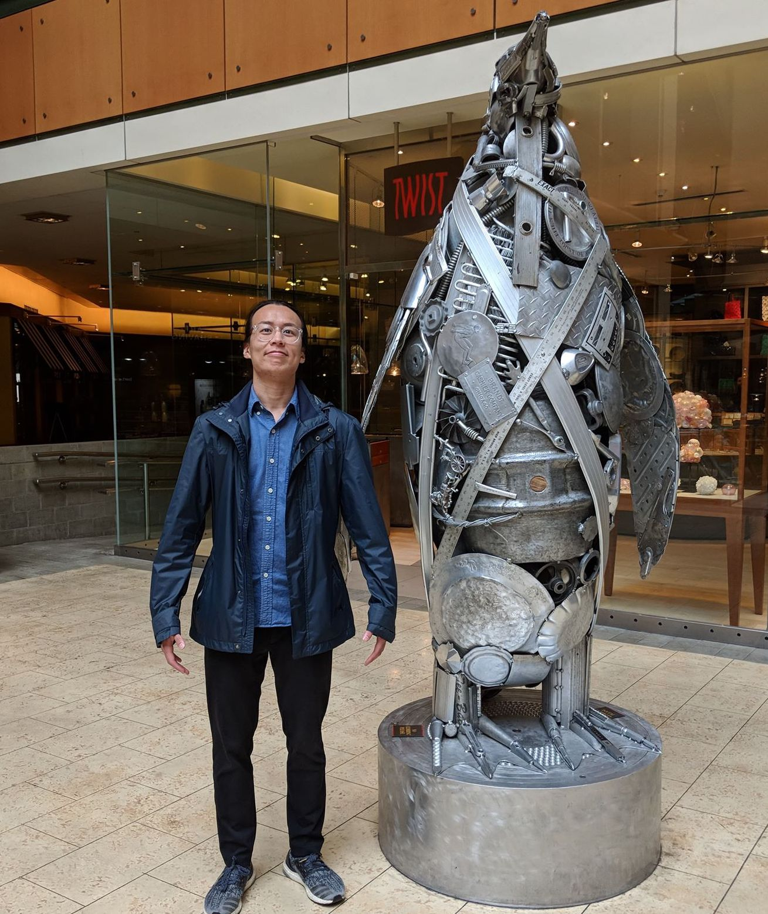

<!-- One -->
	<!--<section id="one">
		

			<!--<header class="major">
				<h1>About Us</h1>
			</header>
		

	</section>-->

	<section id="Mission">
		

			<header class="major">
				<h2 id="Mission">Our mission: </h2>
				
Our purpose is to foster discussions about how technology can be utilized to create a better world. In addition, we will work to advance the national organization’s mission: to empower a new generation of leaders working at the intersection of technology and social impact.
			
			</header>
		

	</section>
	<!--
-->
	<section id="Exec">
		

			<header class="major">
				<h2>Executive Members</h2>
			</header>
		

	</section>
	<section id="two" class="spotlights">
		

			

				<h2>Cassidy Soutter</h2>
			

		

		

			

				<h4>Why are you passionate about CS+SG?</h4>
				
Technology is one of the most powerful tools that we have widespread access to as a society. As we continue to develop its possibilities, it is important that we understand the repercussions of our actions and find a way to use tech to help create social good. I hope that CS+SG will be a start for us, as a community, to make a positive impact on the people around us and help to develop a healthier relationship with the way we use computer science for good.

				<h4>Fun facts about me!</h4>
				
In my spare time, I like to listen to jazz, bake, knit and watch the Office.

			

			

				
			

		

		

			

				<h2>Isabella (Izzi) Hinks</h2>
			

		

		

			

				
			

			

				<h4>Why are you passionate about CS+SG?</h4>
				
With great power comes great responsibility. My favorite part about computer science is that any individual, from any background, can use it as a tool for good. I'm passionate about CS+SG because it empowers students from all walks of life to collaborate and use our growing skills to help our community.

				<h4>Fun facts about me!</h4>
				
I'm a certified yoga teacher, and I'm passionate about teaching communities who may benefit from it most -- at-risk youth, cancer patients and survivors, and veterans with combat stress and PTSD. 

			

		

		

			

				<h2>Austin Wang</h2>
			

		

		

			

				<h4>Why are you passionate about CS+SG?</h4>
				
I think there are a lot of worthy causes that need just a little technological guidance. Even as students, we can do small & simple things to lend a hand. I think CS+SG is a great way to open up more diverse opportunities for CS majors. CS+SG can help students who aren't interested in tech/finance/academia discover new career paths.

				<h4>Fun facts about me!</h4>
				
I hang out in the Hackerspace (SN0027) a lot during the school year. Feel free to drop by! My favorite season is winter. I tell myself I don't have a favorite color, but I think it's either orange or blue.

			

			

				
			

		

		

			

				<h2>Timothy Lo</h2>
			

		

		

			

				
			

			

				<h4>Why are you passionate about CS+SG?</h4>
				
I’ve always been interested in technology and the various ways it can be utilized. CS+SG offers opportunities that give back to the community while also allowing its members to learn about the growing usages of technology.

			

		

	</section>
	<section id="Member">
		

			<header class="major">
				<h2>Our Members</h2>
			</header>
			
			

				

					

					

					

					<!-- Break -->
					

					

					

					<!-- Break -->
					

					

					

				

			

		

	</section>

<!-- Content -->
<h2 id="content">Sample Content</h2>

Praesent ac adipiscing ullamcorper semper ut amet ac risus. Lorem sapien ut odio odio nunc. Ac adipiscing nibh porttitor erat risus justo adipiscing adipiscing amet placerat accumsan. Vis. Faucibus odio magna tempus adipiscing a non. In mi primis arcu ut non accumsan vivamus ac blandit adipiscing adipiscing arcu metus praesent turpis eu ac lacinia nunc ac commodo gravida adipiscing eget accumsan ac nunc adipiscing adipiscing.

	

		<h3>Sem turpis amet semper</h3>
		
Nunc lacinia ante nunc ac lobortis. Interdum adipiscing gravida odio porttitor sem non mi integer non faucibus ornare mi ut ante amet placerat aliquet. Volutpat commodo eu sed ante lacinia. Sapien a lorem in integer ornare praesent commodo adipiscing arcu in massa commodo lorem accumsan at odio massa ac ac. Semper adipiscing varius montes viverra nibh in adipiscing blandit tempus accumsan.

	

	

		<h3>Magna odio tempus commodo</h3>
		
In arcu accumsan arcu adipiscing accumsan orci ac. Felis id enim aliquet. Accumsan ac integer lobortis commodo ornare aliquet accumsan erat tempus amet porttitor. Ante commodo blandit adipiscing integer semper orci eget. Faucibus commodo adipiscing mi eu nullam accumsan morbi arcu ornare odio mi adipiscing nascetur lacus ac interdum morbi accumsan vis mi accumsan ac praesent.

	

	<!-- Break -->
	

		<h3>Interdum sapien gravida</h3>
		
Nunc lacinia ante nunc ac lobortis. Interdum adipiscing gravida odio porttitor sem non mi integer non faucibus ornare mi ut ante amet placerat aliquet. Volutpat eu sed ante lacinia sapien lorem accumsan varius montes viverra nibh in adipiscing blandit tempus accumsan.

	

	

		<h3>Faucibus consequat lorem</h3>
		
Nunc lacinia ante nunc ac lobortis. Interdum adipiscing gravida odio porttitor sem non mi integer non faucibus ornare mi ut ante amet placerat aliquet. Volutpat eu sed ante lacinia sapien lorem accumsan varius montes viverra nibh in adipiscing blandit tempus accumsan.

	

	

		<h3>Accumsan montes viverra</h3>
		
Nunc lacinia ante nunc ac lobortis. Interdum adipiscing gravida odio porttitor sem non mi integer non faucibus ornare mi ut ante amet placerat aliquet. Volutpat eu sed ante lacinia sapien lorem accumsan varius montes viverra nibh in adipiscing blandit tempus accumsan.

	

<!-- Elements -->
<h2 id="elements">Blog</h2>

	

<!-- Text stuff -->
<h3>Text</h3>

This is <b>bold</b> and this is <strong>strong</strong>. This is <i>italic</i> and this is <em>emphasized</em>.
This is superscript text and this is subscript text.
This is <u>underlined</u> and this is code: <code>for (;;) { ... }</code>.
Finally, this is a <a href="#">link</a>.

<h2>Heading Level 2</h2>
<h3>Heading Level 3</h3>
<h4>Heading Level 4</h4>

Nunc lacinia ante nunc ac lobortis. Interdum adipiscing gravida odio porttitor sem non mi integer non faucibus ornare mi ut ante amet placerat aliquet. Volutpat eu sed ante lacinia sapien lorem accumsan varius montes viverra nibh in adipiscing blandit tempus accumsan.

<!-- Lists -->
<h3>Lists</h3>

	

		<h4>Unordered</h4>
		<ul>
			<li>Dolor etiam magna etiam.</li>
			<li>Sagittis lorem eleifend.</li>
			<li>Felis dolore viverra.</li>
		</ul>

		<h4>Alternate</h4>
		<ul class="alt">
			<li>Dolor etiam magna etiam.</li>
			<li>Sagittis lorem eleifend.</li>
			<li>Felis feugiat viverra.</li>
		</ul>

	

	

		<h4>Ordered</h4>
		<ol>
			<li>Dolor etiam magna etiam.</li>
			<li>Etiam vel lorem sed viverra.</li>
			<li>Felis dolore viverra.</li>
			<li>Dolor etiam magna etiam.</li>
			<li>Etiam vel lorem sed viverra.</li>
			<li>Felis dolore viverra.</li>
		</ol>

		<h4>Icons</h4>
		<ul class="icons">
			<li><a href="#" class="icon fa-twitter">Twitter</a></li>
			<li><a href="#" class="icon fa-facebook">Facebook</a></li>
			<li><a href="#" class="icon fa-instagram">Instagram</a></li>
			<li><a href="#" class="icon fa-github">Github</a></li>
			<li><a href="#" class="icon fa-dribbble">Dribbble</a></li>
			<li><a href="#" class="icon fa-tumblr">Tumblr</a></li>
		</ul>
		<ul class="icons">
			<li><a href="#" class="icon alt fa-twitter">Twitter</a></li>
			<li><a href="#" class="icon alt fa-facebook">Facebook</a></li>
			<li><a href="#" class="icon alt fa-instagram">Instagram</a></li>
		</ul>

	

<h4>Definition</h4>
<dl>
	<dt>Item1</dt>
	<dd>
		
Lorem ipsum dolor vestibulum ante ipsum primis in faucibus vestibulum. Blandit adipiscing eu felis iaculis volutpat ac adipiscing accumsan eu faucibus. Integer ac pellentesque praesent. Lorem ipsum dolor.

	</dd>
	<dt>Item2</dt>
	<dd>
		
Lorem ipsum dolor vestibulum ante ipsum primis in faucibus vestibulum. Blandit adipiscing eu felis iaculis volutpat ac adipiscing accumsan eu faucibus. Integer ac pellentesque praesent. Lorem ipsum dolor.

	</dd>
	<dt>Item3</dt>
	<dd>
		
Lorem ipsum dolor vestibulum ante ipsum primis in faucibus vestibulum. Blandit adipiscing eu felis iaculis volutpat ac adipiscing accumsan eu faucibus. Integer ac pellentesque praesent. Lorem ipsum dolor.

	</dd>
</dl>

<h4>Actions</h4>
<ul class="actions">
	<li><a href="#" class="button special">Default</a></li>
	<li><a href="#" class="button">Default</a></li>
</ul>
<ul class="actions small">
	<li><a href="#" class="button special small">Small</a></li>
	<li><a href="#" class="button small">Small</a></li>
</ul>

	

		<ul class="actions vertical">
			<li><a href="#" class="button special">Default</a></li>
			<li><a href="#" class="button">Default</a></li>
		</ul>
	

	

		<ul class="actions vertical small">
			<li><a href="#" class="button special small">Small</a></li>
			<li><a href="#" class="button small">Small</a></li>
		</ul>
	

	

		<ul class="actions vertical">
			<li><a href="#" class="button special fit">Default</a></li>
			<li><a href="#" class="button fit">Default</a></li>
		</ul>
	

	

		<ul class="actions vertical small">
			<li><a href="#" class="button special small fit">Small</a></li>
			<li><a href="#" class="button small fit">Small</a></li>
		</ul>
	

<!-- Blockquote -->
<h3>Blockquote</h3>
<blockquote>Fringilla nisl. Donec accumsan interdum nisi, quis tincidunt felis sagittis eget tempus euismod. Vestibulum ante ipsum primis in faucibus vestibulum. Blandit adipiscing eu felis iaculis volutpat ac adipiscing accumsan faucibus. Vestibulum ante ipsum primis in faucibus vestibulum. Blandit adipiscing eu felis.</blockquote>
<!-- Image -->
<h3>Image</h3>

<h4>Fit</h4>

	

		

		

		

		<!-- Break -->
		

		

		

		<!-- Break -->
		

		

		

	

<h4>Left &amp; Right</h4>

Lorem ipsum dolor sit accumsan interdum nisi, quis tincidunt felis sagittis eget. tempus euismod. Vestibulum ante ipsum primis in faucibus vestibulum. Blandit adipiscing eu felis iaculis volutpat ac adipiscing accumsan eu faucibus. Integer ac pellentesque praesent tincidunt felis sagittis eget. tempus euismod. Vestibulum ante ipsum primis sagittis eget. tempus euismod. Vestibulum ante ipsum primis in faucibus vestibulum. Blandit adipiscing eu felis iaculis volutpat ac adipiscing accumsan eu faucibus. Integer ac pellentesque praesent tincidunt felis sagittis eget tempus vestibulum ante ipsum primis in faucibus magna blandit adipiscing eu felis iaculis.

Lorem ipsum dolor sit accumsan interdum nisi, quis tincidunt felis sagittis eget. tempus euismod. Vestibulum ante ipsum primis in faucibus vestibulum. Blandit adipiscing eu felis iaculis volutpat ac adipiscing accumsan eu faucibus. Integer ac pellentesque praesent tincidunt felis sagittis eget. tempus euismod. Vestibulum ante ipsum primis sagittis eget. tempus euismod. Vestibulum ante ipsum primis in faucibus vestibulum. Blandit adipiscing eu felis iaculis volutpat ac adipiscing accumsan eu faucibus. Integer ac pellentesque praesent tincidunt felis sagittis eget tempus vestibulum ante ipsum primis in faucibus magna blandit adipiscing eu felis iaculis.

<!-- Box -->
<h3>Box</h3>

	
Felis sagittis eget tempus primis in faucibus vestibulum. Blandit adipiscing eu felis iaculis volutpat ac adipiscing accumsan eu faucibus. Integer ac pellentesque praesent tincidunt felis sagittis eget. tempus euismod. Magna sed etiam ante ipsum primis in faucibus vestibulum. Blandit adipiscing eu ipsum primis in faucibus vestibulum. Blandit adipiscing eu felis iaculis volutpat ac adipiscing accumsan eu faucibus lorem ipsum.

<!-- Preformatted Code -->
<h3>Preformatted</h3>
<pre><code>i = 0;

while (!deck.isInOrder()) {
    print 'Iteration ' + i;
    deck.shuffle();
    i++;
}

print 'It took ' + i + ' iterations to sort the deck.';
</code></pre>

</section>

