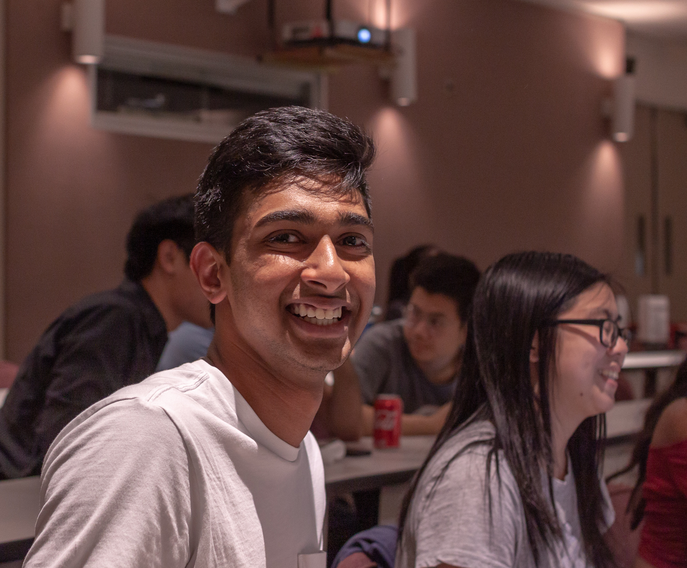
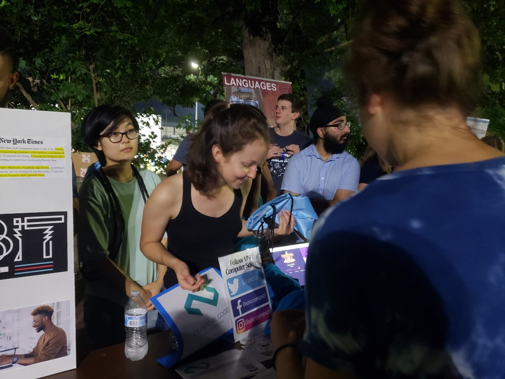
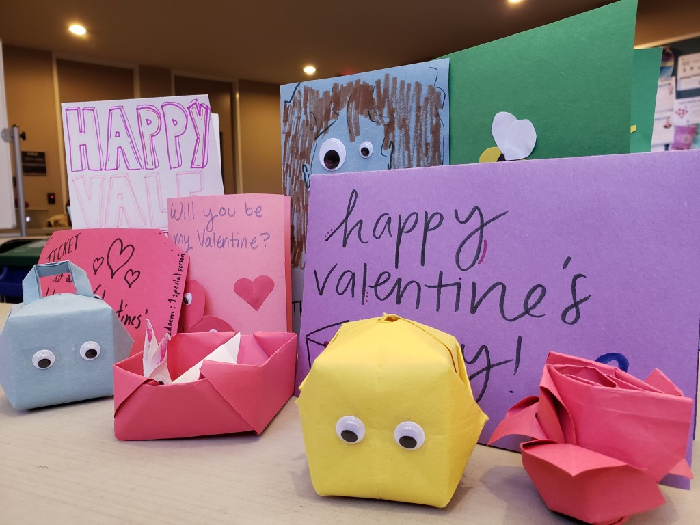

<!-- Main -->

<!-- One -->
<!--<section id="one">
	

		
		<header class="major">
			<h2>Apply to be a member!</h2>
		</header>
		
Are you interested in using technology to create social good? We are an organization for all students at UNC, both undergraduate and graduate students. We are looking for people who are eager to make a difference in their community and are ready to devote time to a cause that matters to them.

		<ul class="actions">
			<li><a href="https://docs.google.com/forms/d/15Akd1tY8OvEyc3APeauhZ_PSiDgBI3FQxdqc5RiH7u0/" class="button special big">Apply now</a></li>
		</ul>
	

</section>-->

<!-- Two -->
<section id="two" class="spotlights">
	<section>
		
		

			

				<header class="major">
					<h3>Apply to be a member!</h3>
				</header>
				
Are you interested in using technology to create social good? We are an organization for all students at UNC, both undergraduate and graduate students. We are looking for people who are eager to make a difference in their community and are ready to devote time to a cause that matters to them.

				<ul class="actions">
					<li><a href="https://docs.google.com/forms/d/15Akd1tY8OvEyc3APeauhZ_PSiDgBI3FQxdqc5RiH7u0/" class="button special big">Apply now</a></li>
				</ul>
			

		

	</section>
	<!---->
	<section>
		
		

			

				<header class="major">
					<h3>Find the need in your community.</h3>
				</header>
				
Within our community, we are the most aware of what our needs and problems are. We each have the power to make a difference, which starts with advocation for the problem. Once people are aware, we can create a creative solution to bridge the gap with what we need.

				<ul class="actions">
					<li><a href="generic.html" class="button">Learn more</a></li>
				</ul>
			

		

	</section>
	<section>
		
		

			

				<header class="major">
					<h3>Tell us how we can help.</h3>
				</header>
				
Be the advocate for your community. Tell others what is happening and share what is important to you. Unfortunately, many communities share similar problems. Together we are stronger.

				<ul class="actions">
					<li><a href="https://docs.google.com/forms/d/e/1FAIpQLSdug-fT_YsV0NUG7LPFBJXyzi9bFwYIDqiV1cjY-BaRZOjW3Q/viewform?usp=pp_url" class="button">Join our listserv</a></li>
				</ul>
			

		

	</section>
	<section>
		
		

			

				<header class="major">
					<h3>Get to work.</h3>
				</header>
				
Find a way to bridge the gaps and make a change. We are each capable of great things. What will you do with your abilities?

				<ul class="actions">
					<!--<li><a href="generic.html" class="button">Learn more</a></li>-->
				</ul>
			

		

	</section>
</section>

